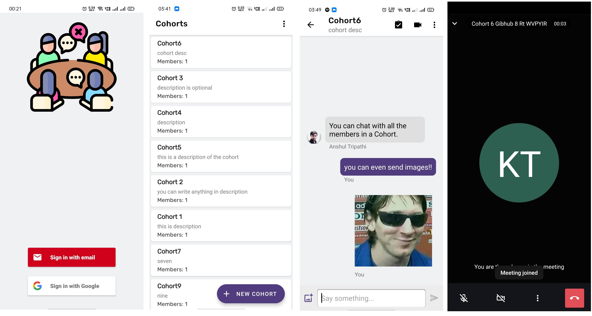
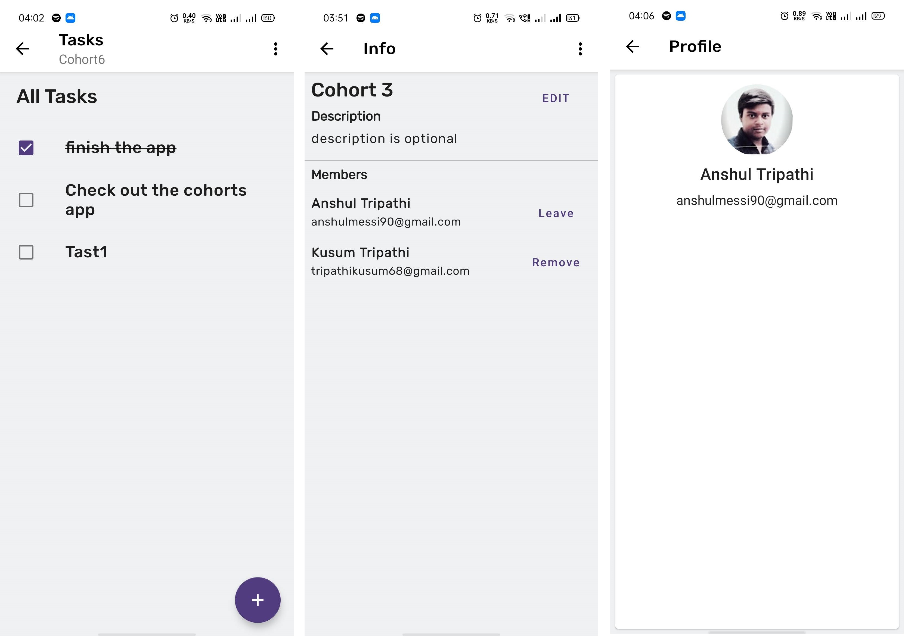
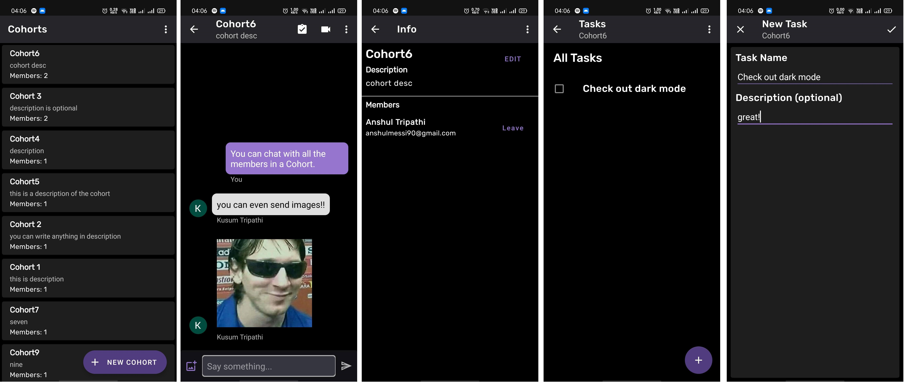
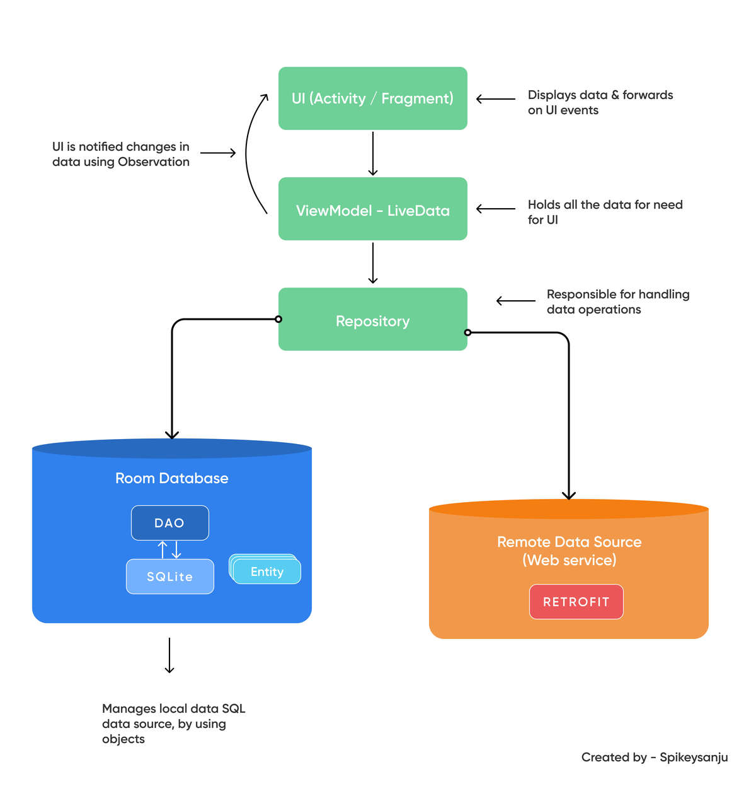

# Cohorts

A minimalistic collaboration android app for organising a video meet of up to 20 people, 
chat in realtime chat and add tasks to be done.

## Install Cohorts
Install The app on your Android device by downloading the latest APK from the given link.

[Get Latest APK](https://drive.google.com/drive/folders/1IN1qMayoN1HsaKvCEPPCuPnQlCTmGbxm?usp=sharing)

## Compile instructions
Anyone who clones this repo and runs gradle build *won't be able to compile the app because they
won't have their developing machine's SHA keys registered on Firebase*. You will get Firebase Error code: 10.
Please ping me on my mail - anshul.3pathi@gmail.com for registering you machine's SHA keys on 
Firebase.

# Screenshots

# Features

## Login
Login with Google or the user can login with Email and Password.

## Cohorts
Cohort is a group in which members can start a video meet, chat with members
and add tasks to be done.

## Add New Cohort
Add new Cohort by giving it a name and maybe a description.

### Add members in a Cohort
Add new member by clicking on the Cohort, clicking the 3 dots on top and selecting 
*Add New Member* option. Users, who are on Cohort, can be added using their emails.

### Cohort Info
View detailed information about the Cohort, edit the name or description of the Cohort,
remove a user from the Cohort or leave the Cohort.
Get to Cohort info by clicking a Cohort then clicking the 3 dots on top and selecting 
*Cohort Info*.

### Delete a Cohort
Delete the Cohort by clicking on Cohort, click on 3 dots on top right and then select *Delete Cohort*.

## Video Calling
Users can start a new video meeting in a Cohort by clicking the video icon on the top.

Up to 20 people can join the video meeting. Users can turn on or off their videos, mute of unmute 
their mics.

## Chats
Users can chat with all the other members of the Cohort in realtime. Users can also send images
in Chat.

Click on the images to view them enlarged and pinch to zoom.

## Tasks
Add Tasks to do within Cohorts. Users can view the tasks, mark them complete or active,
delete of with Task details. Click on the check box to mark a task complete or active.

Clear completed Tasks by clicking on 3 dots and selecting *Clear Completed*.
Clear all Tasks by clicking on 3 dots and selecting *Clear All*.

### Add new Task
Add a new task by clicking on the + icon.

### Task Detail
Click on the Task to view it's details. Edit the Task by clicking the edit button at bottom right 
corner of the screen, mark the task complete of active or delete the task by clicking on 
the top right corner.

## Profile
View your Profile by coming to the Cohort screen clicking the 3 dots and selecting *Profile*

## Dark Mode
App wide dark mode is available. Users can change the theme of the app by coming to Cohort 
screen clicking the 3 dots and selecting the *Theme*.

## Design Methodologies

### Agile
The project is primarily built using the [Agile](https://www.cprime.com/resources/what-is-agile-what-is-scrum/)
methodology. Each feature is planned first before development begins and developed incrementally
without breaking the existing app.

### Modularised
This app is highly modularised. There are different packages for different screens that only contain
the logic for that screen, like Activity or Fragment classes, ViewModel, Adapters, etc.
Following a modularised approach makes the app scalable and less daunting to understand.

## Built with
- [Kotlin](https://kotlinlang.org/) - First class and official programming language for Android development.
- [Coroutines](https://kotlinlang.org/docs/reference/coroutines-overview.html) - For asynchronous and more..
- [Android Architecture Components](https://developer.android.com/topic/libraries/architecture) - Collection of libraries that help you design robust, testable, and maintainable apps.
  - [LiveData](https://developer.android.com/topic/libraries/architecture/livedata) - Data objects that notify views when the underlying database changes.
  - [ViewModel](https://developer.android.com/topic/libraries/architecture/viewmodel) - Stores UI-related data that isn't destroyed on UI changes. 
  - [DataBinding](https://developer.android.com/topic/libraries/data-binding?authuser=1) - Generates a binding class for each XML layout file present in that module and allows you to write powerful binding expressions for binding data directly to layouts.
- [Hilt](https://dagger.dev/hilt/) - Dependency Injection Framework
- [NavigationComponents](https://developer.android.com/guide/navigation) - For handling the navigation within the app.
- [Glide](https://bumptech.github.io/glide/) - An image loading library for Android backed by Kotlin Coroutines.
- [Material Components for Android](https://github.com/material-components/material-components-android) - Modular and customizable Material Design UI components for Android.
- [MaterialColors](https://github.com/theapache64/material_colors) - Android material color palettes.
- [Firebase Firestore](https://firebase.google.com/products/firestore) - For saving users data and Cohort information.
- [Firebase Realtime Database](https://firebase.google.com/products/realtime-database) - For saving chats belonging to different Cohorts.
- [Firebase Authentication](https://firebase.google.com/products/auth) - For authenticating the users.
- [Firebase Storage](https://firebase.google.com/products/storage) - For storing the image files sent in Cohorts chat.
- [Jitsi](https://jitsi.github.io/handbook/docs/intro) - For establishing peer to peer connection and sharing video feed and
audio of users.
 

## Architecture 🗼

This project follows the famous MVVM architecture but doesn't have the Room Database layer.
The remote service used is from Firebase.

